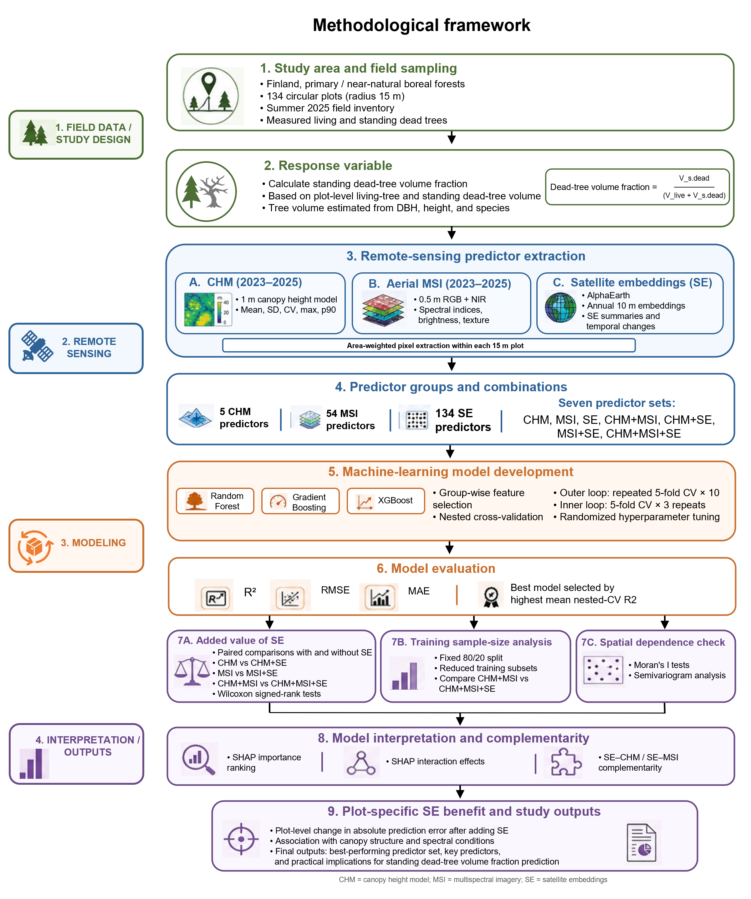

# Satellite embeddings and standing dead-tree volume fraction in boreal forests

This repository contains the data and code for the manuscript **"Satellite Embeddings as Complementary Predictors of Standing Dead-Tree Volume Fraction in Boreal Forests"**.

The repository is organized so researchers can reproduce the modelling analysis directly from the public analysis-ready predictor matrix. Separate extraction scripts document how CHM, MSI, and AlphaEarth satellite-embedding predictors were generated from raw spatial data.

## Methodological framework



## Repository structure

```text
├── data/
│   ├── analysis_ready_predictor_matrix.csv
│   ├── variable_descriptions.csv
│   └── variable_group_summary.csv
├── scripts/
│   ├── 00_full_analysis_workflow.py
│   ├── 01a_extract_chm_predictors.py
│   ├── 01b_extract_msi_predictors.py
│   ├── 01c_extract_se_predictors.py
│   ├── 01d_build_analysis_matrix.py
│   ├── 02_model_nested_cv.py
│   ├── 03_added_value_SE.py
│   ├── 04_training_sample_size.py
│   ├── 05_shap_analysis.py
│   ├── 06_condition_specific_analysis.py
│   ├── 07_make_final_figures_tables.py
│   ├── 08_spatial_sampling_summary.py
│   ├── run_all_analysis.py
│   └── README_scripts.md
├── results/
├── figures/
├── docs/
├── requirements.txt
├── LICENSE
├── DATA_LICENSE.md
└── README.md
```

## Data included

`data/analysis_ready_predictor_matrix.csv` is the modelling table used by the analysis scripts. It includes:

- anonymized plot identifier;
- standing dead-tree volume fraction response variable;
- CHM predictors;
- aerial MSI predictors;
- AlphaEarth satellite-embedding predictors;
- temporal-change satellite-embedding predictors.

Exact field-plot coordinates and raw raster files are not included because of site-sensitivity and file-size considerations. The extraction scripts document the raw-data processing workflow.

## Reproducing the modelling analysis

Create a Python environment and install dependencies:

```bash
pip install -r requirements.txt
```

Run the full modular modelling analysis from the included predictor matrix:

```bash
python scripts/run_all_analysis.py \
  --data data/analysis_ready_predictor_matrix.csv \
  --out-root results/ANALYSIS \
  --figures final \
  --overwrite
```

This executes the following stages in order:

1. nested CV model comparison;
2. SE added-value analysis;
3. training-size / label-efficiency analysis;
4. SHAP interpretation and complementarity analysis;
5. condition-specific SE-benefit analysis;
6. manuscript-ready figures and tables.

The spatial-sampling summary script is optional and requires the private plot/study-area geometry file, which is not included in the public repository.

The original complete workflow is also retained as:

```text
scripts/00_full_analysis_workflow.py
```

## Predictor extraction workflow

The predictor-extraction workflow is intentionally separated into three extraction scripts.

### 1. CHM predictors

```bash
python scripts/01a_extract_chm_predictors.py \
  --polygons path/to/plot_buffers.shp \
  --output results/00_extracted_predictors/chm_predictors.csv \
  --cache-dir temporary_chm_cache \
  --delete-cache-after-run
```

This script extracts Finnish Forest Centre Latvusmalli CHM predictors with partial-pixel weighting. It tries `uusin` first for each plot/map sheet and then falls back to the newest available annual file if no valid CHM pixels are found.

### 2. MSI predictors

```bash
python scripts/01b_extract_msi_predictors.py \
  --plots-vector path/to/plot_buffers.shp \
  --msi-folder path/to/aerial_RGBNIR \
  --output-csv results/00_extracted_predictors/msi_predictors.csv
```

This script extracts aerial RGB-NIR/MSI bands, vegetation indices, brightness summaries, NDVI fractions, and selected texture predictors.

### 3. AlphaEarth SE predictors

```bash
python scripts/01c_extract_se_predictors.py \
  --plots-vector path/to/plot_buffers.shp \
  --se-2025-folder path/to/AlphaEarth_2025 \
  --se-previous-folder path/to/AlphaEarth_previous_year \
  --output-csv results/00_extracted_predictors/se_predictors.csv
```

This script extracts 64 AlphaEarth 2025 embedding-band means and temporal-change `dSE` predictors from a previous-year embedding layer.

### 4. Build the analysis matrix

```bash
python scripts/01d_build_analysis_matrix.py \
  --chm-csv results/00_extracted_predictors/chm_predictors.csv \
  --msi-csv results/00_extracted_predictors/msi_predictors.csv \
  --se-csv results/00_extracted_predictors/se_predictors.csv \
  --volume-csv path/to/plot_dead_fraction.csv \
  --output-csv results/00_extracted_predictors/analysis_ready_predictor_matrix.csv
```

## Spatial sampling summary

The spatial sampling summary can be regenerated from the private plot/study-area geometry file using:

```bash
python scripts/08_spatial_sampling_summary.py \
  --input path/to/study_area.zip \
  --name-col Name \
  --out-dir results/08_spatial_sampling
```

This writes `study_area_plot_counts.csv` and `spatial_sampling_summary.csv`. Exact plot geometries are not included in the public repository because of site-sensitivity considerations.

## Main outputs

When `run_all_analysis.py` is completed, results are written under the selected `--out-root`, including:

- nested cross-validation performance tables;
- paired SE added-value results;
- label-efficiency results;
- SHAP and complementarity outputs;
- condition-specific SE-benefit outputs;
- final manuscript-style figures and tables.
